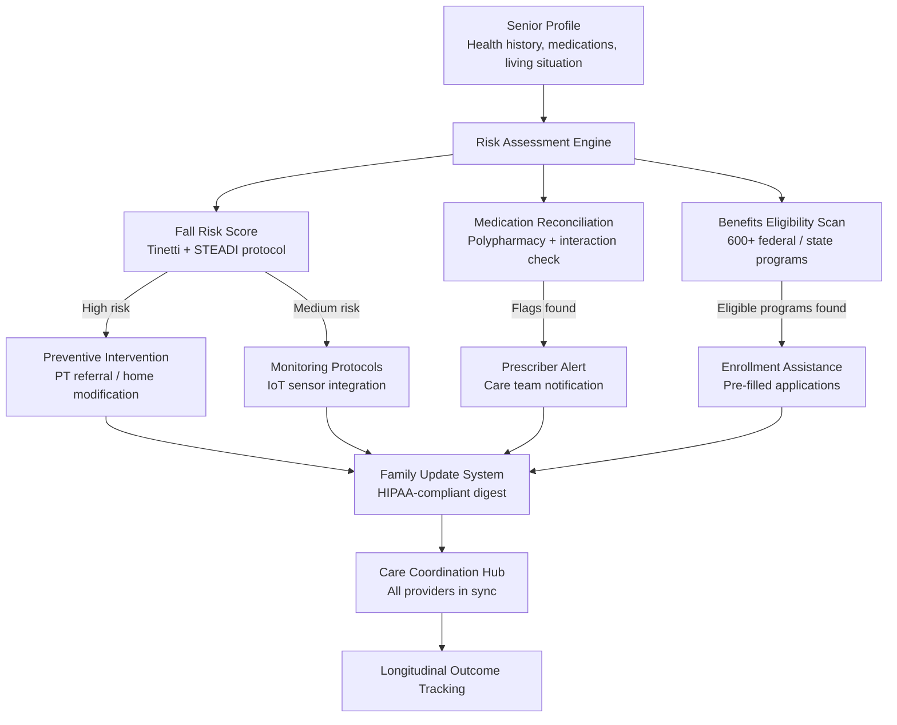

<p align="center">
  <h1 align="center">MAMA Elder Care</h1>
  <h3 align="center"><em>HIPAA-compliant care coordination. Fall prevention. Benefits optimization.<br>Because aging shouldn't mean navigating healthcare alone.</em></h3>
</p>

<p align="center">
  <a href="LICENSE"></a>
  
  
  
  
  <a href="https://mama.oliwoods.ai"></a>
  <a href="https://mama.oliwoods.ai/foundation"></a>
</p>

---

> **Falls are the leading cause of fatal and non-fatal injury in adults over 65. Every 11 seconds, an older adult is treated in an emergency room for a fall. Every 19 minutes, one dies from a fall.** Meanwhile, the average senior is eligible for 15 benefits programs they've never enrolled in — Social Security, Medicare Savings Programs, SNAP, LIHEAP — leaving $6,000–$14,000 per year unclaimed because the navigation is impossible without help. **This library coordinates the whole picture: AI risk scoring that predicts falls before they happen, care team communication that keeps everyone aligned without phone trees, and an automated benefits optimizer that finds every dollar a senior is owed.** HIPAA-compliant at the algorithm level, so any application built on it inherits the compliance posture by default.

---

## Why This Exists

- **Falls cost $50 billion per year** in direct medical costs (CDC, 2023). AI-based prevention has demonstrated 30-35% reduction in fall rates in clinical trials (Sherrington et al., 2019) — this library puts those models in the hands of any care coordination app.
- **The benefits gap is massive.** An estimated $30B in public benefits go unclaimed each year by eligible seniors due to navigation complexity (NCOA, 2022). The average senior qualifies for 15 programs; the enrollment process requires navigating 47 different agencies.
- **Family caregivers are burning out.** 53 million Americans provide unpaid care to a family member. 23% report their health has declined as a result (AARP, 2023). The family-update module reduces coordination overhead so caregivers can be present, not just logistical.
- **HIPAA compliance shouldn't be a moat.** Most care coordination tools charge $200-800/month and use HIPAA compliance as a selling point to lock in institutional buyers. We've built compliance into the open-source layer so community health workers, nonprofits, and family caregivers can deploy it too.

---

## How It Works



---

## Features & Modules

| Module | What It Does |
|--------|-------------|
| **fall-risk-scoring** | AI risk scoring using Tinetti Assessment Tool and CDC STEADI protocol. Incorporates medication data, environmental factors, and gait/mobility history. Outputs risk tier with specific intervention recommendations |
| **medication-reconciliation** | Polypharmacy analysis for seniors on 5+ medications. Identifies drug-drug interactions, fall-risk medications (sedatives, antihypertensives), and duplicate therapies. Triggers prescriber alerts |
| **benefits-optimizer** | 600+ federal, state, and local benefits programs. Automated eligibility screening against senior profile data. Outputs ranked program list with pre-filled application templates |
| **care-coordination** | Shared care plan management across PCPs, specialists, home health aides, and family. Task assignment, status tracking, and escalation rules. HIPAA-compliant data segregation by role |
| **family-updates** | Configurable digest of care events for family caregivers. Severity routing (routine vs. urgent). HIPAA minimum-necessary filters — family sees what they need, not the full clinical record |
| **home-safety** | Environmental risk assessment for fall hazards (lighting, grab bars, floor surfaces, bathroom access). Integrates with IoT sensor data for real-time monitoring |
| **nutrition-screening** | MNA (Mini Nutritional Assessment) encoded as an algorithm. Flags malnutrition risk and triggers dietitian referral. SNAP/meal delivery enrollment integration |
| **social-isolation** | Loneliness risk scoring using UCLA Loneliness Scale. Volunteer visitor matching, telephone reassurance program routing, senior center connections |
| **advance-directives** | Structured storage and retrieval of advance directives, POLST, and healthcare proxy designations. Surfaces at point of care when relevant |
| **transition-care** | Hospital-to-home transition coordination. Medication reconciliation at discharge, follow-up scheduling, and 30-day readmission risk scoring |

---

## How It Works — Technical

This is a **TypeScript algorithm library** — pure functions with Zod schemas, HIPAA-compliant by design at the algorithm level.

```typescript
import {
  scoreFallRisk,               // Tinetti + STEADI + medication data
  reconcileMedications,        // Polypharmacy + interaction detection
  findEligibleBenefits,        // 600+ program eligibility engine
  buildCarePlan,               // Multi-provider coordination
  generateFamilyUpdate,        // HIPAA-filtered digest
  screenNutrition,             // MNA protocol implementation
  scoreTransitionRisk,         // 30-day readmission prediction
} from "mama-elder-care";
```

**HIPAA compliance architecture:**
- Data minimization at the function call level — callers specify what data each role receives
- No PII ever logs to standard output; separate audit log channel
- Encryption-at-rest schemas built into Zod types
- Role-based access control enforced at the algorithm layer, not just the API layer

---

## Research Backing

> Sherrington, C., Fairhall, N. J., Wallbank, G. K., et al. (2019). "Exercise for preventing falls in older people living in the community." *Cochrane Database of Systematic Reviews, 1.* — AI-guided exercise prescription reduces fall rates by 23-35% in community-dwelling older adults.

> Gillespie, L. D., Robertson, M. C., et al. (2012). "Interventions for preventing falls in older people living in the community." *Cochrane Database of Systematic Reviews.* — Multifactorial assessment and intervention programs reduce injurious falls by 24%.

> CDC (2023). *STEADI — Stopping Elderly Accidents, Deaths & Injuries.* — The STEADI protocol, which this library encodes, identifies fall risk with 78% sensitivity and 77% specificity in community settings.

> NCOA (2022). *BenefitsCheckUp Annual Report.* — $30B in benefits go unclaimed annually. The average benefits-eligible senior is enrolled in fewer than 30% of programs they qualify for.

> Masnoon, N., Shakib, S., Kalisch-Ellett, L., & Caughey, G. E. (2017). "What is polypharmacy? A systematic review of definitions." *BMC Geriatrics, 17*(230). — 65% of adults 65+ take 5+ medications; polypharmacy is the most modifiable fall risk factor in this population.

---

## Quick Start

```bash
git clone https://github.com/OliWoods-Org/mama-elder-care.git
cd mama-elder-care
npm install
npm run build
npm test
```

## Tech Stack

- **Runtime:** Node.js + TypeScript
- **Validation:** Zod schemas (with HIPAA-aware types)
- **Database:** Supabase (PostgreSQL) with row-level security
- **AI:** Claude API for care plan summarization / benefit eligibility reasoning
- **Alerts:** Twilio (SMS/voice), Resend (email), push notifications
- **IoT:** Home sensor integration (fall detection, medication dispenser, activity monitors)

---

## Related Projects

| Project | Description |
|---------|-------------|
| [mama-mental-health](https://github.com/OliWoods-Org/mama-mental-health) | Mental health support — depression and isolation are primary comorbidities in elder care |
| [mama-ai-clinic](https://github.com/OliWoods-Org/mama-ai-clinic) | Offline AI device for seniors in rural / low-connectivity settings |
| [foundation-rx-access](https://github.com/OliWoods-Org/foundation-rx-access) | Prescription assistance — deeply integrated with benefits-optimizer module |
| [mama-access-to-justice](https://github.com/OliWoods-Org/mama-access-to-justice) | Legal aid for elder law, guardianship, and housing issues |

---

## Contributing

Elder care technology is desperately underfunded and understaffed. We need:

- **Geriatric clinicians** — Validate fall-risk scoring models and care plan templates
- **Benefits navigators** — Expand program database and keep eligibility rules current
- **Family caregivers** — User research on the family-update module UX
- **Accessibility specialists** — Voice interfaces and large-print UI patterns for seniors

See [CONTRIBUTING.md](CONTRIBUTING.md) for guidelines.

---

## License

AGPL-3.0. Free forever. An [OliWoods Foundation](https://github.com/OliWoods-Org) project.

> *"The way a society treats its elderly is a measure of its soul."*

---

<p align="center">
  <strong>Built by the <a href="https://oliwoods.ai">OliWoods Foundation</a></strong><br>
  <em>Free forever. Open source. Because the people who built everything shouldn't have to navigate it alone.</em>
</p>
